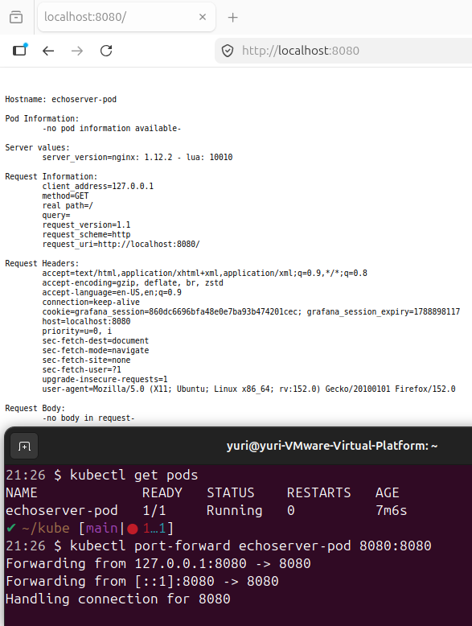
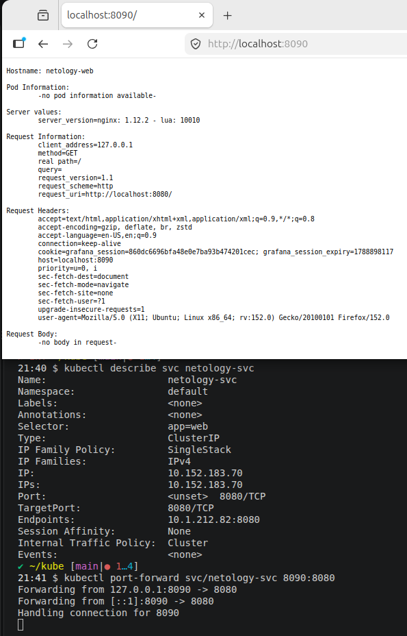

# Задание 1. Создать Pod с именем hello-world
Создать манифест (yaml-конфигурацию) Pod.
Использовать image - gcr.io/kubernetes-e2e-test-images/echoserver:2.2.
Подключиться локально к Pod с помощью kubectl port-forward и вывести значение (curl или в браузере).

# Задание 2. Создать Service и подключить его к Pod
Создать Pod с именем netology-web.
Использовать image — gcr.io/kubernetes-e2e-test-images/echoserver:2.2.
Создать Service с именем netology-svc и подключить к netology-web.
Подключиться локально к Service с помощью kubectl port-forward и вывести значение (curl или в браузере).

